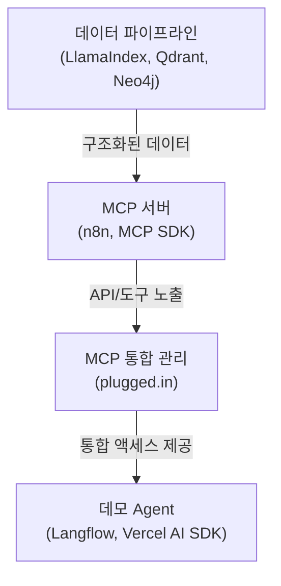

# Data MCP / API 플랫폼

> AI 서비스를 위한 고품질 데이터 공급 플랫폼

## 핵심 가치 제안

Data MCP/API 플랫폼은 AI와 Agent 기반 서비스에 필수적인 고품질, 구조화된 데이터를 쉽고 빠르게 제공합니다. 개발자들이 데이터 문제보다 **핵심 비즈니스 로직**에 집중할 수 있도록 지원합니다.

## 주요 특징

* **다양한 데이터 접근 방식**
  * **MCP(Model Context Protocol)** - Claude, Cursor 등과 직접 연동
  * **REST API** - 기존 애플리케이션과 쉽게 통합
  * **LangChain Agent** - 개발 프레임워크와 즉시 연동

* **AI 최적화된 데이터**
  * 유사도 검색을 위한 벡터 임베딩
  * 명확한 스키마를 가진 구조화된 형식
  * 지속적인 데이터 갱신 및 품질 관리

* **개발자 중심 경험**
  * 간편한 통합 및 사용법
  * 상세한 문서와 예제 코드
  * 빠른 시작을 위한 튜토리얼

## 시스템 아키텍처

## 문서 구성

### 개요 문서

* [프로젝트 배경](/overview/background.md) - AI 데이터 공급 플랫폼의 필요성과 비전
* [문제 정의와 해결 방안](/overview/problem-solution.md) - AI 개발자가 겪는 데이터 문제와 우리의 솔루션

### 비즈니스 문서 

* [사업화 전략](/business/strategy.md) - 범용/니치 데이터 접근법과 단계별 사업화 계획
* [리스크 분석](/business/risks.md) - 주요 리스크 요인과 대응 전략

### 기술 문서

* [시스템 아키텍처](/technical/architecture.md) - 데이터 파이프라인부터 데모 Agent까지 전체 시스템 구조

## 시작하기

1. [시스템 아키텍처](/technical/architecture.md)를 검토하여 전체 시스템 구성 이해하기
2. 각 컴포넌트별 상세 구현 방법은 기술 문서 참조
3. 데모 Agent를 통해 실제 데이터 활용 예시 확인

## 프로젝트 현황

현재 초기 개발 단계로, 프로젝트 문서화 및 개념 증명(PoC) 작업이 진행 중입니다. 관심 있으신 개발자나 파트너사는 문의 바랍니다. 

---

## GitHub Pages

이 문서는 GitHub Pages에서 확인할 수 있습니다:  
[https://vlock-neo-jung.github.io/project-x](https://vlock-neo-jung.github.io/project-x)

> 📝 **참고**: 실제 배포 시 위 URL을 GitHub 사용자 이름과 리포지토리 이름에 맞게 수정해주세요. 