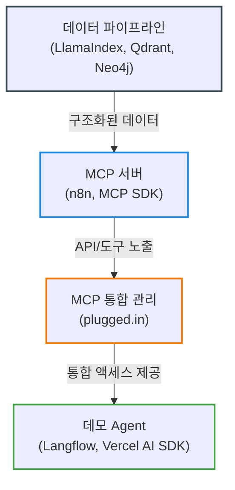

# 초기 시스템 아키텍처

## 시스템 개요 (다이어그램)

본 문서는 Data MCP / API 플랫폼의 초기 서비스 구현을 위한 시스템 아키텍처를 기술함. 주요 구성 요소는 다음과 같음.

## 1. 데이터 파이프라인: 수집, 가공 및 저장 (Orchestrated by LlamaIndex)

AI 및 RAG 활용에 최적화된 데이터를 구축하기 위한 파이프라인. 전체 파이프라인 구성 및 실행은 **LlamaIndex** 프레임워크를 활용하여 자동화 및 효율화를 추구함.

*   **데이터 소스:** 수집 대상 데이터 종류 (예: 웹 페이지, API, 문서 파일 등). LlamaIndex의 다양한 데이터 로더(Data Loaders) 활용.
*   **수집 (Crawling/Fetching):** 데이터 소스로부터 원본 데이터를 가져오는 단계.
*   **가공 및 구조화 (Processing & Structuring):**
    *   **문서 파싱 및 청킹(Chunking):** LlamaIndex의 노드 파서(Node Parsers)를 이용해 문서를 의미 있는 단위(청크)로 분할.
    *   **정보 추출 및 메타데이터 생성:** 각 청크에서 핵심 정보, 키워드, 관계 등을 추출하여 메타데이터로 구성. (Neo4j 지식 그래프 구성에 활용)
    *   **데이터 변환:** AI 모델이 이해하기 쉬운 형식(JSON 등)으로 변환.
*   **임베딩 (Embedding):**
    *   처리된 텍스트 청크를 벡터로 변환. (LlamaIndex 내 임베딩 모델 연동)
*   **저장소 (Storage): 데이터 유형별 최적화된 저장소 활용**
    *   **벡터 데이터 저장 (for Semantic Search):**
        *   **Qdrant:** 고성능 벡터 데이터베이스. 임베딩된 벡터를 저장하고 빠른 유사도 검색 지원. LlamaIndex의 벡터 스토어(Vector Stores) 연동.
    *   **구조화된 데이터 및 지식 그래프 저장 (for Contextual Enrichment):**
        *   **Neo4j:** 그래프 데이터베이스. 추출된 정보와 데이터 간의 관계를 **지식 그래프 형태**로 저장. 단순 벡터 검색을 넘어, 관계 기반의 깊이 있는 컨텍스트 추론 및 정보 제공에 활용. 원본 데이터의 핵심 구조나 메타데이터 저장에도 사용 가능. LlamaIndex의 그래프 스토어(Graph Stores) 및 문서/키-값 스토어(Document/KV Stores) 연동 가능성 고려.
    *   **파이프라인 관리:** LlamaIndex를 통해 데이터 로딩, 변환, 임베딩, 인덱싱(Qdrant, Neo4j) 과정을 통합 관리.

## 2. Data MCP 서버: 데이터 제공 인터페이스

가공/저장된 데이터를 외부 애플리케이션(MCP 호스트)에서 표준화된 방식으로 사용할 수 있도록 제공하는 서버.

*   **핵심 기능:** **Model Context Protocol (MCP) 준수.**
    *   MCP는 애플리케이션이 LLM에게 컨텍스트(데이터, 도구 등)를 제공하는 방식을 표준화하는 **오픈 프로토콜**임. (특정 Agent 프레임워크에 종속되지 않음)
    *   이를 통해 Claude Desktop, IDE 확장 기능 등 다양한 MCP 호스트(클라이언트) 애플리케이션과 우리 데이터 플랫폼 간의 **상호 운용성**을 확보함.
*   **구현 방식:** MCP 사양을 만족하는 서버 구현. **두 가지 주요 접근 방식 고려:**
    1.  **직접 구현:** MCP 공식 사양 및 사용 가능한 SDK(예: C# 등)를 기반으로 직접 서버 로직을 개발. (세밀한 제어 및 최적화 가능)
    2.  **n8n 활용 (권장):** 로우코드 자동화 도구인 **n8n**의 **MCP Server Trigger** 노드를 활용. n8n 워크플로우 자체를 MCP 호환 서버로 빠르게 노출시켜 개발 속도 및 편의성 극대화.
*   **(부가 기능) RESTful API 엔드포인트:** MCP 외에도 전통적인 방식의 데이터 접근을 위해 별도의 RESTful API 제공 가능 (예: `/search`, `/data/{id}` 등).
*   **인증 및 인가:** MCP 및 API 접근 제어를 위한 보안 방식 적용 (예: Bearer 토큰, API 키 등). (n8n 사용 시 내장 기능 활용 가능)
*   **핵심 로직 (MCP/API 통해 노출):**
    *   키워드 검색, 필터링 로직.
    *   Qdrant 기반 유사도 검색 로직.
    *   Neo4j 기반 관계/컨텍스트 조회 로직.
*   **서버 인프라:**
    *   **직접 구현 시:** 선택한 프로그래밍 언어/프레임워크 기반 서버 (예: Python/FastAPI, Node.js/Express 등).
    *   **n8n 활용 시:** n8n 인스턴스 자체가 서버 역할을 수행.

## 3. MCP 서버 통합 관리: plugged.in 활용

다양한 종류의 Data MCP 서버(2번 섹션에서 구현됨)를 효율적으로 관리하고, AI Agent/클라이언트에서 통합적으로 사용하기 위한 시스템. 이를 위해 **plugged.in** 생태계를 활용함.

*   **문제점:**
    *   다수의 MCP 서버를 개별적으로 관리하고 설정하는 것은 복잡함.
    *   특정 AI Agent/클라이언트(예: Claude Desktop, Cursor)에서 여러 MCP 서버의 도구/리소스를 조합하여 사용하기 위한 설정이 번거로움.
    *   MCP 서버별 컨텍스트 분리 및 관리가 필요함.
*   **해결 방안:** **plugged.in App**과 **plugged.in MCP Proxy**를 도입하여 MCP 서버 관리 및 접근을 중앙화하고 단순화함.
*   **구성 요소:**
    *   **plugged.in App (Web Interface):**
        *   역할: 생성된 여러 Data MCP 서버들을 등록, 설정, 관리하는 **중앙 관리 대시보드**.
        *   주요 기능:
            *   MCP 서버 디스커버리 및 등록.
            *   워크스페이스 기반 MCP 서버 그룹 관리 (컨텍스트 분리).
            *   서버별 도구, 리소스, 프롬프트 조회 및 관리.
            *   서버별 커스텀 지침(Instructions) 또는 노트 추가.
            *   API 키 발급 (MCP Proxy 연동용).
            *   (선택적) 자체 호스팅 또는 클라우드 버전(<https://plugged.in>) 사용.
    *   **plugged.in MCP Proxy (Unified Endpoint):**
        *   역할: AI Agent/클라이언트(Claude, Cursor 등)가 연결하는 **단일 MCP 엔드포인트** 역할 수행.
        *   작동 방식:
            1.  클라이언트로부터 MCP 요청(도구 목록 조회, 도구 호출 등)을 받음.
            2.  `plugged.in App` API를 통해 현재 활성화된 워크스페이스의 MCP 서버 목록 및 능력(capabilities) 정보를 가져옴.
            3.  클라이언트 요청을 해당 능력을 가진 실제 Data MCP 서버로 라우팅.
            4.  실제 Data MCP 서버의 응답을 클라이언트에게 전달.
        *   설치 및 실행: `npx @pluggedin/mcp-proxy@latest` 명령어를 통해 실행하며, `plugged.in App`에서 발급받은 API 키로 연동.
*   **기대 효과:**
    *   **설정 간소화:** AI Agent/클라이언트는 `plugged.in MCP Proxy` 하나만 설정하면 등록된 모든 MCP 서버 접근 가능.
    *   **통합 관리:** 웹 UI를 통해 여러 MCP 서버와 그 기능들을 한눈에 파악하고 관리 용이.
    *   **컨텍스트 분리:** 워크스페이스 기능을 통해 프로젝트나 목적별로 MCP 서버 그룹을 분리하여 관리 가능.
    *   **확장성:** 새로운 Data MCP 서버를 추가하더라도 클라이언트 설정 변경 없이 `plugged.in App`에 등록하기만 하면 됨.

## 4. 데모 Agent (챗봇): MCP 활용 예시 및 외부 제공

플랫폼의 Data MCP 기능을 실제로 활용하는 예시를 보여주고, 외부 사용자가 체험할 수 있도록 제공하는 인터페이스. **구현 용이성을 고려하여 다음 두 가지 방식을 우선적으로 고려함:**

1.  **Langflow 활용 (노코드/로우코드 접근):**
    *   **개요:** 시각적 UI 빌더인 **Langflow**를 사용하여 데모 Agent 플로우를 구성. Langflow는 자체적으로 MCP 서버 및 클라이언트 기능을 지원하므로, 우리가 만든 Data MCP 서버(plugged.in 통해 접근)를 Langflow 내의 도구로 쉽게 통합 가능. ([참고: Langflow MCP 통합](https://blog.langflow.org/introducing-mcp-integration-in-langflow/))
    *   **장점:** 코딩 없이 빠르게 프로토타입 제작 및 데모 구현 가능. 복잡한 Agent 로직도 시각적으로 설계.
    *   **LLM 연동:** Langflow 내에서 지원하는 다양한 LLM 모델 연동 가능.
    *   **UI:** Langflow 자체 제공 인터페이스 활용 또는 API를 통해 외부 UI 연결.
2.  **Vercel AI SDK 활용 (UI 커스터마이징 필요 시):**
    *   **개요:** JavaScript/TypeScript 기반의 **Vercel AI SDK**를 사용하여 챗봇 프론트엔드 및 백엔드 로직 구현. Vercel AI SDK는 MCP 클라이언트 기능을 지원하여 plugged.in Proxy를 통해 Data MCP 서버 도구 호출 가능. ([참고: Vercel AI SDK MCP 클라이언트](https://vercel.com/blog/ai-sdk-4-2))
    *   **장점:** React, Svelte 등 최신 웹 프레임워크와 긴밀하게 통합되어 **챗봇 UI를 자유롭게 커스터마이징**할 수 있음. Vercel 플랫폼을 통한 쉬운 배포.
    *   **LLM 연동:** AI SDK가 지원하는 다양한 LLM 프로바이더 활용.
    *   **UI:** 직접 UI 컴포넌트 구현 (React, Svelte 등).

*   **공통 Agent 로직:**
    *   사용자 질문 분석.
    *   (Langflow Tool 또는 Vercel AI SDK MCP Client 통해) `plugged.in MCP Proxy`로 필요한 Data MCP 서버 도구/리소스 호출.
    *   검색된 데이터를 컨텍스트로 활용하여 LLM에게 답변 생성 요청.
    *   최종 답변 사용자에게 전달.
*   **배포:** 구현 방식에 따라 적절한 방식 선택 (Langflow 서버, Vercel 플랫폼, 클라우드 서버/컨테이너 등). 